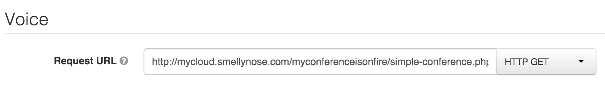

# My Conference Is On Fire

Very basic conferencing system built on Twilio

## Test it out (a little bit, I'm not made of money!)
[http://conference.ashleyhindle.com](http://conference.ashleyhindle.com) or call +441315101552 - then ask your friend to join with the same code!

## How to dial in

* Call your Twilio Number
* Go to your website and use the twilio javascript client

## Setup

* Add a [TwiML app](https://www.twilio.com/user/account/voice/dev-tools/twiml-apps) to your Twilio account and set the Voice URL to `http://mydomain.com/myconferenceisonfire/simple-conference.php` and `HTTP GET`
* [Buy a number](https://www.twilio.com/user/account/voice/phone-numbers) from Twilio and set it to use your new TwiML app.
* Call your new number, and enter any number and ask other people to enter the same number

  

## Browser Connection Setup
* Grab the app's `Sid` from your [TwiML app](https://www.twilio.com/user/account/voice/dev-tools/twiml-apps) configuration
* Grab your `authToken` and `accountSid` from your [account settings](https://www.twilio.com/user/account/settings) page

* Copy `config.php.dist` to `config.php` and set the details
* `composer install`
* Go to `http://mydomain.com/myconferenceisonfire/` and press the big green button

## Nginx Note
I had to add `audio/x-wav             wav;` to `/etc/nginx/mime.types` for Twilio to like my files

## My Thanks
Big thanks to @virelli / http://codepen.io/virelli/pen/mnhgd for the lovely looking dialpad and https://soundcloud.com/alexcornell/im-on-hold-by-alex-cornell for the amazing music
